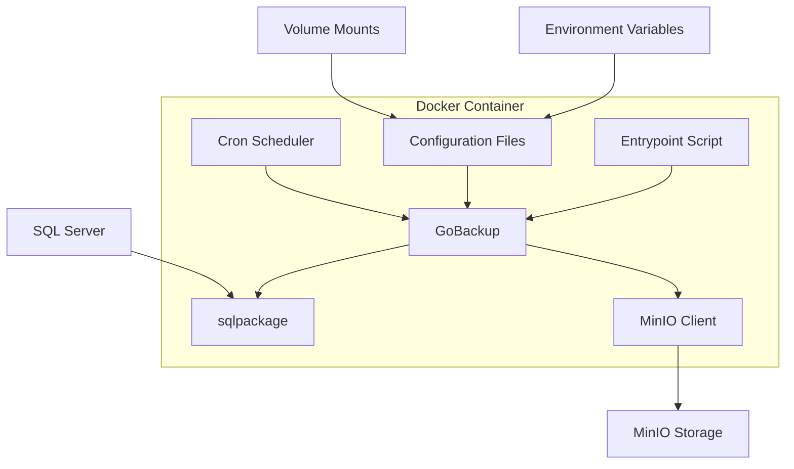

# Design Document: GoBackup SQL Server Docker Image

## Overview

This design specifies a Docker-based solution for automated SQL Server database backups using GoBackup and Microsoft's sqlpackage tool, with MinIO as the storage backend. The solution packages both tools in a single container image, configured to perform scheduled backups and upload them to S3-compatible object storage.

The system leverages GoBackup's native support for SQL Server (via sqlpackage) and MinIO storage backends, requiring minimal custom code. The primary implementation work involves creating a Dockerfile, configuration templates, and an entrypoint script for container orchestration.

## Architecture

### Component Overview



### Data Flow

1. **Initialization**: Container starts, entrypoint script validates configuration
2. **Scheduling**: Cron or GoBackup scheduler triggers backup at configured intervals
3. **Backup Execution**: GoBackup invokes sqlpackage to export database to .bacpac file
4. **Upload**: GoBackup uploads the backup file to MinIO using S3-compatible API
5. **Cleanup**: Temporary local backup files are removed after successful upload
6. **Logging**: All operations are logged to stdout for container log collection

## Components and Interfaces

### 1. Dockerfile

**Purpose**: Define the container image with all dependencies

**Base Image**: `ubuntu:22.04` (LTS for stability)

**Installation Steps**:
1. Install system dependencies (libunwind8, wget, unzip, ca-certificates, cron)
2. Download and install sqlpackage from Microsoft's official URL
3. Download and install GoBackup from GitHub releases
4. Create directory structure for configuration and temporary files
5. Set up symlinks for easy command access
6. Copy entrypoint script and make it executable

**Key Paths**:
- `/usr/local/sqlpackage/` - sqlpackage installation directory
- `/usr/local/bin/sqlpackage` - symlink to sqlpackage executable
- `/usr/local/bin/gobackup` - GoBackup binary
- `/etc/gobackup/` - Configuration directory
- `/tmp/gobackup/` - Temporary backup storage

### 2. GoBackup Configuration

**Configuration File**: `/etc/gobackup/gobackup.yml`

**Structure**:
```yaml
models:
  sqlserver_backup:
    description: "SQL Server automated backup"
    
    schedule:
      cron: "${BACKUP_CRON:-0 2 * * *}"  # Default: 2 AM daily
    
    databases:
      main_db:
        type: mssql
        host: "${MSSQL_HOST}"
        port: "${MSSQL_PORT:-1433}"
        database: "${MSSQL_DATABASE}"
        username: "${MSSQL_USERNAME:-sa}"
        password: "${MSSQL_PASSWORD}"
        trustServerCertificate: "${MSSQL_TRUST_CERT:-true}"
    
    storages:
      minio_storage:
        type: minio
        bucket: "${MINIO_BUCKET}"
        endpoint: "${MINIO_ENDPOINT}"
        region: "${MINIO_REGION:-us-east-1}"
        path: "${MINIO_PATH:-backups/sqlserver}"
        access_key_id: "${MINIO_ACCESS_KEY}"
        secret_access_key: "${MINIO_SECRET_KEY}"
        timeout: 300
        max_retries: 3
```

**Environment Variable Substitution**: GoBackup natively supports `${ENV_VAR}` syntax for environment variable substitution, enabling flexible configuration across environments.

### 3. Entrypoint Script

**Purpose**: Initialize the container, validate configuration, and start GoBackup

**Script**: `/entrypoint.sh`

**Responsibilities**:
1. Validate required environment variables are set
2. Generate gobackup.yml from template with environment variable substitution
3. Test connectivity to SQL Server (optional health check)
4. Test connectivity to MinIO (optional health check)
5. Start GoBackup in appropriate mode (daemon for scheduled backups, or one-time run)

**Pseudocode**:
```
function validate_required_env():
    required = [MSSQL_HOST, MSSQL_DATABASE, MSSQL_PASSWORD, 
                MINIO_ENDPOINT, MINIO_BUCKET, MINIO_ACCESS_KEY, MINIO_SECRET_KEY]
    for var in required:
        if not env_exists(var):
            log_error("Missing required environment variable: " + var)
            exit(1)

function test_sql_connection():
    if SKIP_HEALTH_CHECK is not set:
        result = execute("sqlpackage /Action:Export /SourceServerName:$MSSQL_HOST /SourceDatabaseName:$MSSQL_DATABASE /TargetFile:/tmp/test.bacpac /p:VerifyExtraction=false")
        if result.failed:
            log_warning("SQL Server connection test failed")
        else:
            log_info("SQL Server connection successful")
            remove("/tmp/test.bacpac")

function main():
    log_info("Starting GoBackup SQL Server container")
    
    validate_required_env()
    
    if RUN_MODE == "once":
        log_info("Running one-time backup")
        execute("gobackup perform")
    else:
        log_info("Starting scheduled backup daemon")
        execute("gobackup run")
```

### 4. sqlpackage Integration

**Installation**: sqlpackage is installed during Docker build following Microsoft's official installation instructions

**Usage**: GoBackup automatically invokes sqlpackage with appropriate parameters based on the MSSQL database configuration

**Export Format**: `.bacpac` files (portable database export format)

**Connection String**: Constructed by GoBackup from configuration parameters (host, port, database, username, password)

### 5. MinIO Storage Backend

**Protocol**: S3-compatible API

**Authentication**: Access key and secret key

**Upload Process**: GoBackup handles upload automatically after successful database export

**Path Structure**: `{MINIO_PATH}/{model_name}/{timestamp}/{database_name}.bacpac`

**Retry Logic**: Built into GoBackup (max_retries: 3, timeout: 300s)

## Data Models

### Configuration Model

```
Configuration:
  - mssql_config: MSSQLConfig
  - minio_config: MinIOConfig
  - schedule_config: ScheduleConfig
  - backup_options: BackupOptions

MSSQLConfig:
  - host: string (required)
  - port: integer (default: 1433)
  - database: string (required)
  - username: string (default: "sa")
  - password: string (required, sensitive)
  - trust_server_certificate: boolean (default: true)

MinIOConfig:
  - endpoint: string (required, URL)
  - bucket: string (required)
  - region: string (default: "us-east-1")
  - path: string (default: "backups/sqlserver")
  - access_key_id: string (required, sensitive)
  - secret_access_key: string (required, sensitive)
  - timeout: integer (default: 300)
  - max_retries: integer (default: 3)

ScheduleConfig:
  - cron: string (default: "0 2 * * *")
  - run_mode: enum["daemon", "once"] (default: "daemon")

BackupOptions:
  - workdir: string (default: "/tmp/gobackup")
  - skip_health_check: boolean (default: false)
  - log_level: enum["debug", "info", "warn", "error"] (default: "info")
```

### Backup Artifact Model

```
BackupArtifact:
  - filename: string (format: "{database}_{timestamp}.bacpac")
  - size: integer (bytes)
  - timestamp: datetime (ISO 8601)
  - source_database: string
  - storage_path: string (MinIO object key)
  - checksum: string (optional, for integrity verification)
```

## Correctness Properties

*A property is a characteristic or behavior that should hold true across all valid executions of a system—essentially, a formal statement about what the system should do. Properties serve as the bridge between human-readable specifications and machine-verifiable correctness guarantees.*


### Property Reflection

After analyzing all acceptance criteria, most testable items are specific examples rather than universal properties. This is expected for an infrastructure/deployment project where we're primarily verifying that specific integrations and configurations work correctly.

Many criteria are redundant:
- Requirements 1.3 and 2.2 both verify sqlpackage directory structure
- Requirements 3.1, 6.1, and 8.2 all verify configuration file support
- Requirements 3.2, 5.2 verify backup execution
- Requirements 4.2, 5.3 verify MinIO upload
- Requirements 4.5, 7.4 verify upload failure handling
- Requirements 6.2, 6.4, 8.4 all verify environment variable support

Since this is primarily a Docker image and integration project, we'll focus on integration tests that verify the complete workflows rather than attempting to create universal properties. The testing strategy will emphasize end-to-end scenarios.

### Correctness Properties

Given the nature of this project (Docker image with tool integration), there are no universal properties that apply across all inputs. Instead, we have specific integration requirements that must be verified through example-based testing.

**No universal properties identified** - This project involves:
- Docker image construction (verified at build time)
- Tool installation and configuration (verified through integration tests)
- External system integration (SQL Server, MinIO)

All testable requirements will be verified through integration tests and example-based unit tests rather than property-based tests.

## Error Handling

### Configuration Validation

**Missing Required Variables**: The entrypoint script validates all required environment variables at startup. If any are missing, the container logs a clear error message identifying the missing variable and exits with code 1.

**Invalid Configuration**: If GoBackup detects invalid configuration (e.g., malformed YAML, invalid cron expression), it logs the error and exits. The container should fail fast to prevent silent failures.

### SQL Server Connection Errors

**Connection Failures**: If sqlpackage cannot connect to SQL Server:
- Log the connection error with host, port, and database information
- Retry is not automatic - the backup job fails and will retry on next schedule
- Error details from sqlpackage are captured and logged

**Authentication Failures**: If SQL Server authentication fails:
- Log authentication error (without exposing password)
- Provide guidance on checking credentials and SQL Server configuration
- Exit with non-zero code

### MinIO Upload Errors

**Network Failures**: If MinIO upload fails due to network issues:
- GoBackup automatically retries up to 3 times (configurable via max_retries)
- Each retry is logged with attempt number
- If all retries fail, the local backup file is retained in the workdir
- Error is logged with MinIO endpoint and bucket information

**Authentication Failures**: If MinIO authentication fails:
- Log authentication error with endpoint and bucket
- Provide guidance on checking access key and secret key
- Local backup file is retained

**Bucket Not Found**: If the specified MinIO bucket doesn't exist:
- Log error indicating bucket not found
- Provide guidance on creating the bucket or checking bucket name
- Local backup file is retained

### Disk Space Issues

**Insufficient Space**: If local disk space is insufficient for backup:
- sqlpackage will fail with disk space error
- Error is captured and logged
- Provide guidance on checking available disk space and workdir configuration

### Backup File Integrity

**Corruption Detection**: While the system doesn't automatically verify backup integrity, users can:
- Enable sqlpackage's `/p:VerifyExtraction=true` option via args parameter
- Implement custom verification scripts using before_script/after_script hooks
- Use MinIO's object metadata to store and verify checksums

## Testing Strategy

### Integration Testing Approach

This project requires comprehensive integration testing rather than property-based testing, as we're verifying tool integration and external system connectivity.

### Test Environment Setup

**Required Infrastructure**:
- SQL Server instance (can use SQL Server Docker container for testing)
- MinIO instance (can use MinIO Docker container for testing)
- Docker engine for building and running the image

**Test Data**:
- Sample SQL Server database with known schema and data
- Test MinIO bucket with appropriate permissions

### Integration Test Scenarios

**Test 1: Docker Image Build Verification**
- Build the Docker image
- Verify gobackup binary exists and is executable
- Verify sqlpackage binary exists at /usr/local/sqlpackage/sqlpackage
- Verify symlink exists at /usr/local/bin/sqlpackage
- Verify required dependencies are installed (libunwind8)
- **Validates: Requirements 1.2, 1.3, 1.4, 1.5, 2.1, 2.2, 2.3, 2.4, 2.5**

**Test 2: Configuration File Support**
- Create a test gobackup.yml configuration file
- Mount it into the container at /etc/gobackup/gobackup.yml
- Start the container and verify GoBackup reads the configuration
- Verify no configuration errors in logs
- **Validates: Requirements 3.1, 6.1, 8.2**

**Test 3: Environment Variable Substitution**
- Create configuration file with environment variable placeholders
- Set environment variables when starting container
- Verify GoBackup correctly substitutes variables
- Verify backup runs with substituted values
- **Validates: Requirements 6.2, 6.4, 8.4**

**Test 4: SQL Server Backup Execution**
- Configure connection to test SQL Server instance
- Trigger a backup (one-time mode)
- Verify sqlpackage is invoked
- Verify .bacpac file is created locally
- Verify backup file contains expected data
- **Validates: Requirements 3.2, 3.3, 3.4, 5.2**

**Test 5: MinIO Upload**
- Configure MinIO storage backend
- Run a backup
- Verify backup file is uploaded to MinIO bucket
- Verify file exists at expected path in MinIO
- Verify file size matches local backup
- **Validates: Requirements 4.1, 4.2, 4.3, 4.4, 5.3**

**Test 6: Upload Failure Handling**
- Configure invalid MinIO credentials
- Run a backup
- Verify backup completes locally
- Verify upload fails with appropriate error
- Verify local backup file is retained
- Verify error is logged
- **Validates: Requirements 4.5, 7.4**

**Test 7: Scheduled Backup Execution**
- Configure cron schedule (e.g., every minute for testing)
- Start container in daemon mode
- Wait for scheduled backup to execute
- Verify backup runs automatically
- Verify multiple backups execute on schedule
- **Validates: Requirements 3.5, 5.1**

**Test 8: Logging Verification**
- Run a successful backup
- Verify logs contain operation start time
- Verify logs contain operation parameters (database name, etc.)
- Verify logs contain completion time
- Verify logs contain backup file size
- Verify logs are output to stdout
- **Validates: Requirements 5.4, 7.1, 7.2, 7.5**

**Test 9: Error Logging**
- Simulate sqlpackage failure (invalid database name)
- Verify error is captured in logs
- Verify error output from sqlpackage is included
- Verify logs contain sufficient detail for troubleshooting
- **Validates: Requirements 5.5, 7.3**

**Test 10: Required Configuration Validation**
- Start container without required environment variables
- Verify container fails to start
- Verify error message identifies missing variables
- Test with each required variable missing individually
- **Validates: Requirements 6.3**

**Test 11: Volume Mount for Temporary Storage**
- Mount a volume for workdir
- Run a backup
- Verify temporary files are created in mounted volume
- Verify files are accessible from host
- **Validates: Requirements 8.3**

**Test 12: Long-Running Container**
- Start container in daemon mode
- Verify container stays running
- Verify container doesn't exit unexpectedly
- Monitor for at least 5 minutes
- **Validates: Requirements 8.1**

**Test 13: Health Check**
- Build image with health check defined
- Start container
- Verify Docker reports container as healthy
- Simulate failure condition
- Verify health check detects failure
- **Validates: Requirements 8.5**

### Unit Testing

**Entrypoint Script Tests**:
- Test environment variable validation logic
- Test configuration file generation
- Test error handling for missing variables
- Test different run modes (daemon vs. once)

**Configuration Template Tests**:
- Verify YAML syntax is valid
- Verify all required fields are present
- Verify environment variable placeholders are correctly formatted

### Manual Testing Checklist

Before release, manually verify:
- [ ] Image builds successfully on clean system
- [ ] Image size is reasonable (< 500MB)
- [ ] Backup completes successfully with real SQL Server
- [ ] Upload completes successfully with real MinIO
- [ ] Scheduled backups execute reliably over 24 hours
- [ ] Logs are clear and actionable
- [ ] Documentation is accurate and complete

### Test Execution

**Build-Time Tests**: Run during Docker build to catch issues early
**Integration Tests**: Run in CI/CD pipeline with test infrastructure
**Manual Tests**: Run before releases and major changes

### Testing Tools

- **Docker**: For building and running containers
- **docker-compose**: For orchestrating test infrastructure (SQL Server + MinIO + backup container)
- **Bash scripts**: For integration test automation
- **pytest or similar**: For entrypoint script unit tests (if script becomes complex)

## Implementation Notes

### Dockerfile Best Practices

- Use multi-stage builds if needed to reduce final image size
- Combine RUN commands to reduce layers
- Clean up package manager caches after installation
- Use specific versions for sqlpackage and GoBackup for reproducibility
- Add LABEL metadata for image identification

### Security Considerations

- Never log sensitive credentials (passwords, access keys)
- Use environment variables for all sensitive configuration
- Consider using Docker secrets for production deployments
- Run container as non-root user if possible
- Keep base image and dependencies updated for security patches

### Performance Optimization

- Use appropriate workdir location (consider tmpfs for speed)
- Configure MinIO timeout based on expected backup sizes
- Consider compression settings in GoBackup configuration
- Monitor disk I/O during backups

### Monitoring and Observability

- All logs to stdout for standard container log collection
- Include structured logging (timestamps, log levels)
- Consider adding metrics export (backup duration, file size, success/failure counts)
- Implement health check that verifies GoBackup process is running

### Example docker-compose.yml

```yaml
version: '3.8'

services:
  gobackup:
    image: gobackup-sqlserver:latest
    environment:
      MSSQL_HOST: sqlserver
      MSSQL_PORT: 1433
      MSSQL_DATABASE: myapp_production
      MSSQL_USERNAME: sa
      MSSQL_PASSWORD: ${MSSQL_SA_PASSWORD}
      MSSQL_TRUST_CERT: "true"
      MINIO_ENDPOINT: http://minio:9000
      MINIO_BUCKET: backups
      MINIO_ACCESS_KEY: ${MINIO_ACCESS_KEY}
      MINIO_SECRET_KEY: ${MINIO_SECRET_KEY}
      BACKUP_CRON: "0 2 * * *"
      RUN_MODE: daemon
    volumes:
      - ./gobackup.yml:/etc/gobackup/gobackup.yml:ro
      - backup-temp:/tmp/gobackup
    depends_on:
      - sqlserver
      - minio
    restart: unless-stopped

  sqlserver:
    image: mcr.microsoft.com/mssql/server:2022-latest
    environment:
      ACCEPT_EULA: Y
      SA_PASSWORD: ${MSSQL_SA_PASSWORD}
    volumes:
      - sqlserver-data:/var/opt/mssql

  minio:
    image: minio/minio:latest
    command: server /data --console-address ":9001"
    environment:
      MINIO_ROOT_USER: ${MINIO_ACCESS_KEY}
      MINIO_ROOT_PASSWORD: ${MINIO_SECRET_KEY}
    volumes:
      - minio-data:/data
    ports:
      - "9000:9000"
      - "9001:9001"

volumes:
  sqlserver-data:
  minio-data:
  backup-temp:
```
